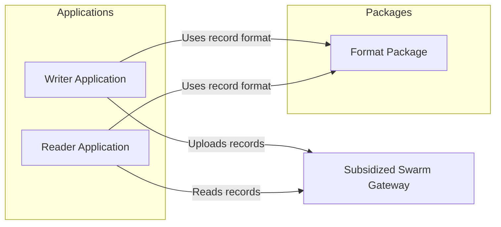

# Deccan Birders — Bird Sightings on Swarm

A decentralized bird-sighting record application built for the **"Take Your Records With You"** challenge.

The project allows users to create bird-sighting records, encode them into a documented format, and store them through a Swarm-compatible upload flow. A separate reader application retrieves and decodes stored records independently from the writer application.

---

## Project Overview

Deccan Birders is organized into two independent applications:

- **Writer:** Handles Swarm ID initialization, connection information, upload capability checks, record encoding, and data uploads.
- **Reader:** Retrieves stored records from Swarm using the record reference and decodes the stored format independently.
- **Format Package:** Defines the shared record structure, format identifier, version, and validation utilities.
- **Acceptance Tests:** Tests important application boundaries using mocked Swarm interfaces.

The project uses the `@snaha/swarm-id` package for the writer flow and `@ethersphere/bee-js` for Swarm data operations.

The implementation is designed to support the subsidized Swarm gateway route for users who do not have their own postage stamp.

---

## Features

### Swarm ID Integration

- Uses `@snaha/swarm-id` for the writer authentication and connection flow.
- Initializes Swarm ID before attempting to connect.
- Reads connection information before attempting an upload.
- Checks the identity and upload capability before uploading data.

### Subsidized Gateway Support

- Uses the configured subsidized Swarm gateway.
- Supports the gateway route intended for users without their own postage stamp.
- Avoids requiring a private key, mnemonic phrase, or gift code in the repository.
- Does not assume that gateway availability or storage capacity is permanent.

### Upload Capability Checking

Before attempting an upload, the writer checks whether the current Swarm ID connection has the required upload capability.

If uploading is unavailable, the application returns a specific failure reason instead of silently attempting the upload.

### Self-Describing Records

Every stored record includes:

- A format identifier
- A format version
- A unique record identifier
- Bird species information
- Observation date
- Location
- Optional references

This allows readers to identify the record format before processing the data.

### Independent Reader

The reader application is separate from the writer application.

It retrieves records using the Swarm data endpoint and decodes the stored payload without importing the writer application's upload logic.

### Correct Swarm Endpoint Usage

The implementation uses the `/bytes` endpoint family for raw record data.

The reader uses the corresponding BeeJS data download functionality to retrieve the stored bytes.

The gateway upload flow does not add unsupported pinning or tagging headers.

### Specific Upload Errors

Upload failures are converted into specific error reasons, helping users understand why an upload could not be completed.

---

## Architecture



### Components

#### `apps/writer`

The writer application:

1. Initializes Swarm ID.
2. Connects to the Swarm ID service.
3. Reads connection information.
4. Checks identity and upload capability.
5. Creates and encodes a bird-sighting record.
6. Uploads the record through the configured Swarm flow.
7. Returns a reference or a specific error reason.

#### `apps/reader`

The reader application:

1. Accepts a Swarm reference.
2. Downloads the stored data using BeeJS.
3. Reads the raw bytes from the `/bytes` endpoint family.
4. Decodes the record.
5. Validates the record format before processing it.

The reader does not import the writer application's upload implementation.

#### `packages/format`

The format package contains the shared record definitions and format-related utilities.

It provides a common structure for the writer and reader while keeping the reader independent from the writer's application logic.

#### `test`

The test workspace contains Jest-based acceptance tests.

The tests use mocked Swarm interfaces to verify important behavior without depending on a live external gateway or performing irreversible live uploads.

---

## Stored Record Format

Each bird-sighting record is encoded as a JSON payload and uploaded as raw bytes.

### Example Record

```json
{
  "formatId": "deccan-birders-sighting",
  "version": 1,
  "recordId": "4ef493b2-601e-4cb2-8e10-ac399be78d91",
  "species": "House Sparrow",
  "observationDate": 1716386392000,
  "location": "Central Park",
  "observerReference": "optional-string",
  "photoReference": "optional-string"
}
```

### Record Fields

| Field | Description |
|---|---|
| `formatId` | Identifies the bird-sighting record format. |
| `version` | Identifies the version of the record schema. |
| `recordId` | Unique identifier for the individual sighting. |
| `species` | Name of the observed bird species. |
| `observationDate` | Observation date represented as a timestamp. |
| `location` | Location where the sighting was recorded. |
| `observerReference` | Optional reference to observer-related information. |
| `photoReference` | Optional reference to a related photo or Swarm resource. |

The `formatId` and `version` fields allow the reader to identify the record structure before processing it.

---

## Project Structure

```text
bird-sightings-swarm/
├── apps/
│   ├── reader/
│   │   ├── package.json
│   │   ├── tsconfig.json
│   │   └── src/
│   │       ├── download.ts
│   │       └── index.ts
│   │
│   └── writer/
│       ├── package.json
│       ├── tsconfig.json
│       └── src/
│           ├── config.ts
│           ├── index.ts
│           └── upload.ts
│
├── packages/
│   └── format/
│       ├── package.json
│       ├── tsconfig.json
│       └── src/
│           ├── index.ts
│           └── types.ts
│
├── test/
│   ├── package.json
│   ├── tsconfig.json
│   ├── jest.config.js
│   └── acceptance.spec.ts
│
├── .env.example
├── .gitignore
├── package-lock.json
└── package.json
```

---

## Technologies Used

- TypeScript
- Node.js
- npm Workspaces
- Jest
- `@snaha/swarm-id`
- `@ethersphere/bee-js`
- Ethereum Swarm
- JSON-based record format

---

## Prerequisites

Before running the project, install the following:

- Node.js 18 or later
- npm
- Git

Check your installed versions:

```bash
node --version
npm --version
```

---

## Installation

Clone the repository:

```bash
git clone https://github.com/mahekkanani/bird-sightings-swarm.git
```

Move into the project directory:

```bash
cd bird-sightings-swarm
```

Install the project dependencies:

```bash
npm install
```

The project uses npm workspaces to manage the applications, shared format package, and test workspace.

---

## Configuration

The project includes an `.env.example` file for configuration reference.

The subsidized gateway configuration is based on:

```text
https://api.gateway.ethswarm.org/
```

No private key, mnemonic phrase, gift code, or other secret credential is required to be committed to the repository.

Gateway availability and upload capability may vary depending on the current Swarm ID connection and gateway conditions.

---

## Building the Project

Build all workspaces from the project root:

```bash
npm run build
```

The build command compiles the relevant workspace packages and applications.

---

## Running the Writer

Run the writer command:

```bash
npm run start:writer
```

The writer flow is responsible for initializing Swarm ID, checking connection information, verifying upload capability, and handling the record upload process.

The availability of a live interactive Swarm ID environment may depend on the configured browser or application context.

---

## Running the Reader

Run the reader with a valid Swarm reference:

```bash
npm run start:reader <swarm-reference>
```

Replace `<swarm-reference>` with the reference of the stored record.

The reader retrieves the record using the Swarm data download flow and processes the returned raw bytes.

---

## Testing

Run the build:

```bash
npm run build
```

Run the test suite:

```bash
npm test
```

The current Jest acceptance suite contains four test cases covering important application behaviors.

The tests use mocked interfaces and do not represent a complete live end-to-end upload to an external Swarm gateway.

### Current Test Coverage

The automated tests cover:

1. Upload capability is checked before an upload is attempted.
2. Each stored record contains a format identifier and version.
3. An independent reader exists and uses the appropriate endpoint family.
4. Upload failures produce specific reasons.

The tests passing does not guarantee that a live external gateway upload will always be available.

---

## Challenge Criteria Coverage

The following table describes the current implementation and verification method.

| Challenge Criterion | Verification Method | Status |
|---|---|---|
| Upload capability is checked before an upload is attempted | Automated Jest test | Verified |
| Subsidized gateway route is configured | Code inspection and configuration review | Implemented |
| Each stored record contains a format identifier and version | Automated Jest test | Verified |
| Reader does not import writer application code | Code inspection and automated test | Verified |
| Records are read through the same endpoint family used for writing | Automated Jest test and code inspection | Verified |
| Gateway upload path does not use unsupported pin/tag options | Code inspection | Implemented |
| Upload failures produce specific reasons | Automated Jest test | Verified |
| No credentials or private secrets are stored in tracked files | Repository and code inspection | Checked |

### Verification Note

The automated tests use mocked Swarm interfaces.

Live gateway availability, live upload behavior, and external Bee node integration require separate manual verification and may depend on the current gateway and Swarm ID environment.

---

## Security and Privacy

The repository is designed to avoid committing sensitive credentials.

The following items should not be committed:

- Private keys
- Mnemonic phrases
- Seed phrases
- Gift codes
- Passwords
- Authentication URLs
- Personal access tokens

The `.gitignore` file and environment configuration approach are used to keep local configuration separate from tracked source code.

Users should review their local environment before publishing changes to a public repository.

---

## Limitations

### Swarm ID Environment

The live Swarm ID flow may depend on the available browser or application context.

The automated tests use mocks for capability and upload behavior and do not replace live environment testing.

### Gateway Availability

The subsidized gateway may have changing availability, upload restrictions, or capacity limitations.

A successful local build or mocked test does not guarantee permanent storage or successful uploads in every live environment.

### Live Integration Testing

The current automated tests do not perform a complete live end-to-end upload and retrieval cycle against an external Swarm gateway.

Manual testing is required to verify the complete live flow.

### Application Scope

This project is an implementation for the Deccan Birders challenge. The writer and reader provide the required structural flow but are not presented as a production-ready bird-sighting platform.

---

## License

No license has been specified for this repository.